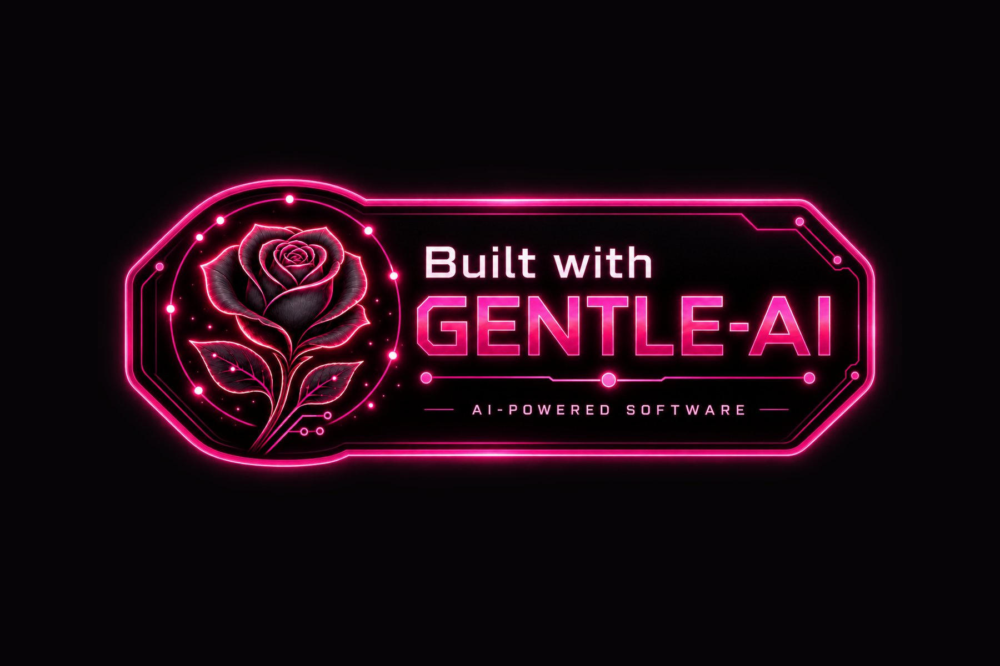

<!-- prettier-ignore -->
<div align="center">

# tikdown-rs

*Self-hosted TikTok archive daemon: monitor accounts, backfill videos, expose status.*

[](https://www.python.org)
[](https://docs.astral.sh/uv/)
[](LICENSE)
[](docs/deployment-docker.md)

[Features](#features) · [Getting started](#getting-started) · [Usage](#usage) · [Operation](#operation) · [Troubleshooting](#troubleshooting) · [Docs](#documentation)

</div>

A daemon and CLI that watch TikTok accounts, backfill their public videos into a plain on-disk
library, and keep you informed through a Telegram bot and a static dashboard. Built on
[yt-dlp](https://github.com/yt-dlp/yt-dlp) with SQLite as the only infrastructure.

> [!CAUTION]
> This tool downloads publicly available content. Respect creators' rights and the platform's
> terms of service — you are responsible for what you download and how you use it.

## Features

- **Account monitoring** — poll accounts on a schedule with randomized pacing, so the traffic
  pattern it produces is not fingerprintable
- **Backfill** — download a full account history in one resumable, cancelable run; survives
  crashes and network outages, deduplicates against the on-disk archive
- **Telegram bot** — read-only status queries, downloads notifications, authorization guards,
  and self-supervising polling (it checks itself and recovers, without restarting the daemon)
- **Transient-aware engine** — a single error classifier separates TikTok WAF challenges, 403/429
  and timeouts (transient) from real auth failures; a bad night of feeds never invalidates a
  healthy cookie
- **Disk & backup safety** — downloads pause on low disk space, and `system backup` produces
  online-safe SQLite snapshots published atomically with retention
- **Integrity & export** — `videos integrity` verifies size + SHA-256 + ffprobe per file;
  `videos export` writes sanitized JSON/CSV
- **Static dashboard** — `system site render` writes 4 self-contained files that any static
  server (nginx, Caddy…) can host, no database attached

Read the [project guide](docs/project-guide.md) for how these features came to be, and
[the deployment guide](docs/deployment-docker.md) for operating details.

## Getting started

### Prerequisites

- [Docker](https://docs.docker.com/get-docker/) with Docker Compose v2
- A Telegram bot token ([create one with @BotFather](https://t.me/BotFather))
- A TikTok session exported as a Netscape-format `cookies.txt` file

### Deploy with Docker (recommended)

```bash
git clone <repo-url> tikdown-rs && cd tikdown-rs
cp .env.example .env

# edit .env and set at least:
#   TELEGRAM_BOT_TOKEN, TELEGRAM_CHAT_ID, TELEGRAM_USER_ID

docker compose up -d --build
```

First-boot verification and the rest of the run (cookies → accounts → backfill → monitoring):

```bash
docker compose exec tikdown-rs tikdown-rs daemon selfcheck
docker compose exec tikdown-rs tikdown-rs cookies add /path/to/cookies.txt
docker compose exec tikdown-rs tikdown-rs accounts add @user --then-monitor
docker compose exec tikdown-rs tikdown-rs backfill run @user --queue
```

Full walkthrough including hardening, updates, backup/restore and first-boot symptoms:
[**Deployment guide**](docs/deployment-docker.md).

> [!IMPORTANT]
> All state (database, cookies, archive, videos) lives in the `./data` volume. Never commit it,
> and never point the static dashboard at the data directory — the database stores cookies
> unencrypted, so backups of it must be treated as secrets.

### Local development

```bash
uv sync          # installs Python 3.13 + locked dependencies (incl. the yt-dlp nightly)
uv run pytest    # full test suite; tests marked `live` need real network and are never run by default
uv run tikdown-rs --help
```

Local runs without Docker are supported for development only; Docker is the target environment
for production.

## Usage

The CLI has 7 noun groups; the most common paths:

```bash
tikdown-rs accounts add @user --then-monitor   # add, backfill then start monitoring
tikdown-rs backfill run @user --queue          # resumable history download
tikdown-rs backfill retry-failed @user         # converge failed rows onto disk files
tikdown-rs daemon status                       # heartbeat, cookies by state, disk, recent errors
tikdown-rs videos integrity @user              # size + SHA-256 + ffprobe per file
tikdown-rs videos export --format csv          # sanitized export to stdout
tikdown-rs system site render                  # static dashboard files
```

Everything above also has a Telegram bot command equivalent; uploads of cookie files through
the bot are allowed but discouraged — sensitive files go through the CLI.

> [!TIP]
> After bumping yt-dlp, the bump is the first suspect: run `daemon selfcheck`, which compares
> the running version against the last known-good one.

## Operation

- **Status & health**: `daemon status` (heartbeat, monitor, cookies by state, disk, recent
  errors), `daemon healthcheck` (light, no network — used as the container `HEALTHCHECK`),
  `daemon selfcheck` (full check incl. ffprobe/ffmpeg and engine version).
- **Backup** : `system backup` writes a `VACUUM INTO` snapshot to `<DATA_DIR>/backups/`
  (online-safe, retention via `SYSTEM_BACKUP_RETAIN_COUNT`, files `chmod 0600`, atomic
  publication). Restore: stop the daemon, copy the snapshot over `tikdown-rs.db`, delete
  `-wal`/`-shm`, restart, run `daemon selfcheck`.
- **Static dashboard**: regenerate with `system site render`, or enable
  `STATIC_SITE_ENABLED=true` and let the daemon refresh it on schedule. The compose file ships
  an optional read-only nginx service for it in `:8080`.

## Troubleshooting

Diagnose in this order:

1. **A transient failure is not a defect** — extractor degradation, WAF challenges, 403/429
   and timeouts classify as `transient`: they pause no accounts, invalidate no cookies, and
   consume no retries. Check the category in `daemon status` → `recent_errors` first.
2. **After a yt-dlp bump, the bump is the default suspect** — `daemon selfcheck` compares
   against `last_known_good_ytdlp_version`.
3. **Every fixed bug adds a row** to the troubleshooting tables and, when it revealed an
   undocumented trap, to Appendix A of the plan.

Full symptom tables (first boot/deploy, TikTok interactions, cookies, Telegram) live in
the [spec's §14.6](specs/Plan%20de%20implementacion%20tikdown-rs.md).

## Documentation

| Document | Contents |
| --- | --- |
| [`docs/deployment-docker.md`](docs/deployment-docker.md) | step-by-step Docker deployment, compose hardening walkthrough, updates, backup/restore |
| [`docs/project-guide.md`](docs/project-guide.md) | how the project evolved: milestones, real-world failures, design lessons |
| [`specs/Plan de implementacion tikdown-rs.md`](specs/Plan%20de%20implementacion%20tikdown-rs.md) | normative specification: data model, engine, daemon, bot, troubleshooting, design decisions |

## License

[MIT](LICENSE)

<div align="center">


<sub>Post de <a href="https://x.com/egdev66/status/2102774191925944415">@egdev66</a> en X — imagen reproducida con fines de atribución.</sub>

</div>
